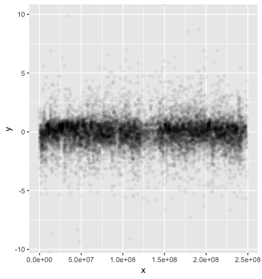
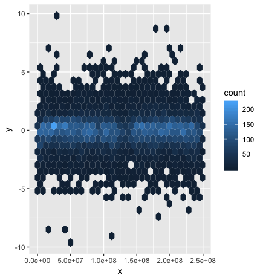
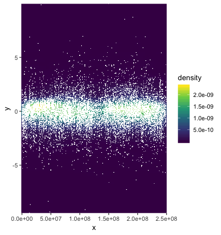

## VISUALIZATION TEST

In the .r file you can find the commented code.
I tried a lot of different things, in the end I decided to upload the three best
visualizations, you can find those below. I used the library ggplot.

## SCATTER PLOT

## HEXAGONAL BINNING

## DENSITY

